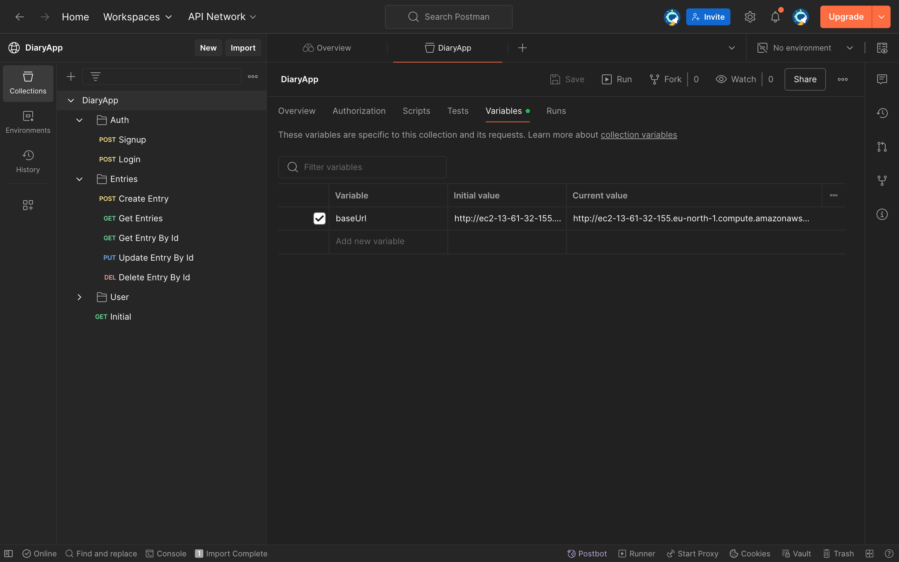
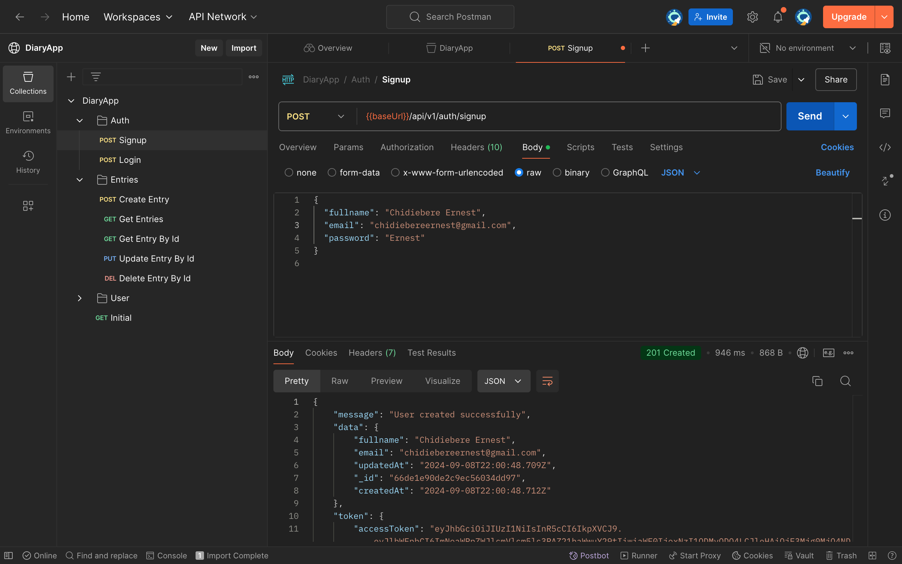

# Diary Backend

This repo contains the code for the backend of the Diary app

# UI

https://www.figma.com/file/mInGGZavWcHPtrekfNnHkw/Diaree!?type=design&node-id=0-1&mode=design&t=4PCY4jsPVbPEucaN-0

# Postman documentation




https://www.postman.com/red-crater-997277/workspace/diaryapp/collection/32234478-23dfee9d-d8b6-4df6-aab2-b525092402a4?action=share&creator=32234478

## Getting Started

```bash
# install dependencies
npm install

# start server in watch mode
npm dev

# run test
npm run test
```
